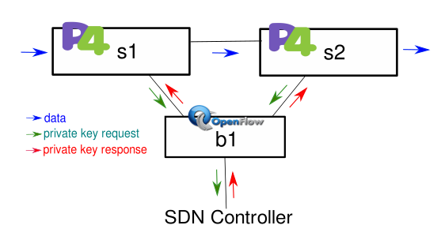
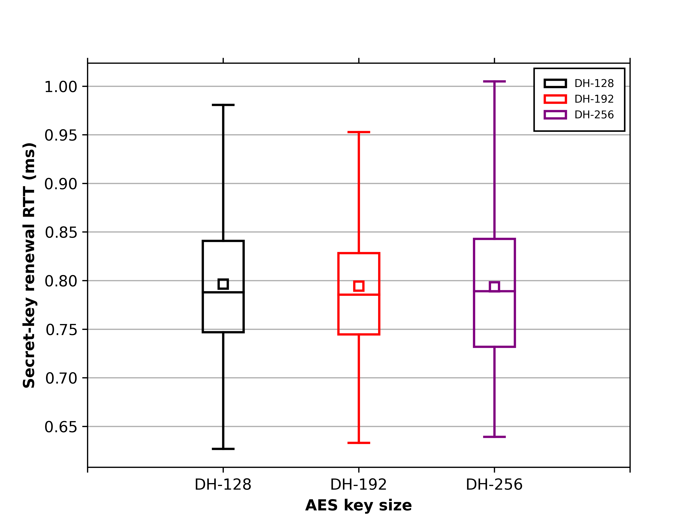
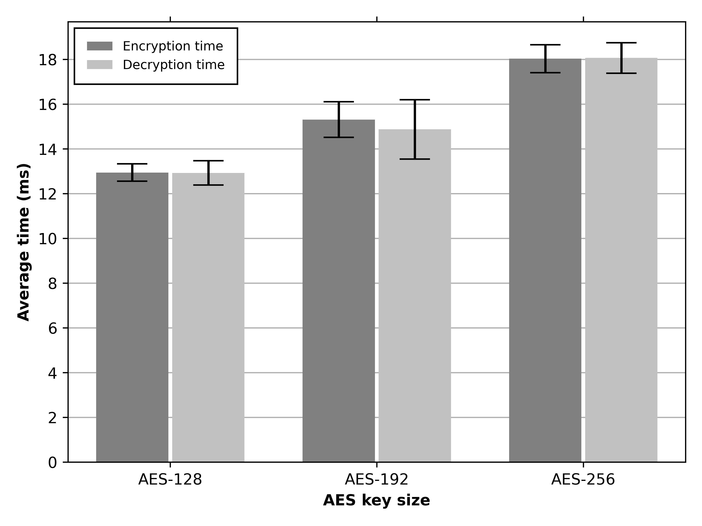

## Test DH-AES 128, 192 or 256 bits

### What will be possible to accomplish in this repository?

You will be able to perform step-by-step experiments on how to have a network topology using Diffie-Hellman and AES together. The network scenarios you can find within this page include:

- **[Generic test](#generic-test)**: This validates our cryptographic system
- **[Embedded scenario](#embedded-scenario)**: In this scenario, the p4 switch is responsible for all the cryptographic system
- **[Controller-based scenario](#controller-based-scenario)**: In this scenario, each packet is encrypted and the controller is triggered to install the private keys
- **[No encrypted scenario](#no-encrypted-scenario)**: This tests the no-encrypted scenario
- **[Diffie-Hellman](#diffie-hellman)**: This tests the Secret-Key Renewall RTT
- **[Encryption/Decryption time](#encryptiondecryption-time)**: This tests the encryption and decryption time
- **[Dropped packets](#dropped-packets)**: This intends to count the number of dropped packets. However, this does not work with bmv2 due to performance issues

### Preparing the environment

#### Installing Mininet-WiFi:

    ~/$ git clone https://github.com/intrig-unicamp/mininet-wifi
    ~/$ cd mininet-wifi
    ~/mininet-wifi$ sudo util/install.sh -WlnfvP

#### Installing python dependencies:

    ~/dh-aes-p4$ pip install scapy matplotlib numpy scipy

#### Generating the LUT and sbox tables:

    ~/dh-aes-p4$ cd utils
	~/dh-aes-p4$/utils$ python table.py > table.txt

#### Compiling the P4 code:

    ~/dh-aes-p4$ cd p4src
	~/dh-aes-p4/p4src$ p4c --target bmv2 --arch v1model dh_aes.p4 -o build

##### Note: You can find minimal differences on the numerical values compared to the results used in this document.

### Network topology

The network topology used in the experiments follows a linear arrangement. In this way, host `h1` is connected to switch `s1-eth1` and host `h2` is connected to switch `s2-eth1`. Both `s1` and `s2` switches are also connected to each other (`s1-eth2 <--> s2-eth2`). Thus, when `s1` receives the packet sent by `h1`, it forwards the packet to `s2` and then the packet is delivered to `h2`. 

---

### Generic test:


```
~/dh-aes-p4$ cd mininet
~/dh-aes-p4/mininet$ sudo python mn_code.py test 256
```

Press `enter` in the `c1:sender` terminal; press `enter` in the `h1:sender` terminal; and exit from Mininet-WiFi`s terminal:

```
mininet-wifi> exit
```

Then, run:

```
~$ python ../utils/pcap.py
```

#### Expected result

```
============= Ethernet Frame {s1-eth3.cap} ===========

0000  44 20 06 1C 00 06 02 14 12 A1 20 DC 02 00 F0 10  D ........ .....
0010  40 82 43 00 0D 28 CC 14 C2 0D 10 02 19 24 00 76  @.C..(.......$.v
0020  00                                               .
0000  00 28 04 08 A1 42 00 50 12 41 28 41 00 00 40 44  .(...B.P.A(A..@D
0010  00 02 D3 02 19 88 4C 06 D3 1E 14 02 90 90 04 12  ......L.........
0020  01                                               .
0000  00 00 00 00 00 00 00 00 00 00 00 00 00 00 00 00  ................
0010  00 00 00 00 00 00 00 00 00 00 00 00 00 00 00 00  ................
0020  02                                               .
0000  41 0F 55 F6 BC 6B 14 2D B8 9F 24 05 C7 4E C3 86  A.U..k.-..$..N..

============= Ethernet Frame {s1-eth2.cap} ===========

0000  44 20 06 1C 00 06 02 14 12 A1 20 DC 02 00 F0 10  D ........ .....
0010  40 82 43 00 0D 28 CC 14 C2 0D 10 02 19 24 00 76  @.C..(.......$.v
0020  00                                               .
0000  00 28 04 08 A1 42 00 50 12 41 28 41 00 00 40 44  .(...B.P.A(A..@D
0010  00 02 D3 02 19 88 4C 06 D3 1E 14 02 90 90 04 12  ......L.........
0020  01                                               .
0000  00 00 00 00 00 00 00 00 00 00 00 00 00 00 00 00  ................
0010  00 00 00 00 00 00 00 00 00 00 00 00 00 00 00 00  ................
0020  02                                               .
0000  41 0F 55 F6 BC 6B 14 2D B8 9F 24 05 C7 4E C3 86  A.U..k.-..$..N..

============= Ethernet Frame {s2-eth2.cap} ===========

0000  44 20 06 1C 00 06 02 14 12 A1 20 DC 02 00 F0 10  D ........ .....
0010  40 82 43 00 0D 28 CC 14 C2 0D 10 02 19 24 00 76  @.C..(.......$.v
0020  00                                               .
0000  00 28 04 08 A1 42 00 50 12 41 28 41 00 00 40 44  .(...B.P.A(A..@D
0010  00 02 D3 02 19 88 4C 06 D3 1E 14 02 90 90 04 12  ......L.........
0020  01                                               .
0000  00 00 00 00 00 00 00 00 00 00 00 00 00 00 00 00  ................
0010  00 00 00 00 00 00 00 00 00 00 00 00 00 00 00 00  ................
0020  02                                               .
0000  41 0F 55 F6 BC 6B 14 2D B8 9F 24 05 C7 4E C3 86  A.U..k.-..$..N..

============= Ethernet Frame {s1-eth1.cap} ===========

0000  70 6C 61 69 6E 20 74 65 78 74 20 20 20 20 20 20  plain text      

============= Ethernet Frame {s2-eth1.cap} ===========

0000  70 6C 61 69 6E 20 74 65 78 74 20 20 20 20 20 20  plain text
```

---

### Embedded scenario:

#### Running the code:

```
~/dh-aes-p4$ cd mininet
~/dh-aes-p4/mininet$ sudo python mn_code.py embedded
```

Wait to finish inserting the tables entries into the switch. Then, in the `h1:sender` terminal press enter.    

After the `h1:sender` terminal closes, run: 

```
mininet-wifi> exit
```

Finally, extract data from the pcap files:

```
python embedded/generate_aes_time.py 256
```

---

### Controller-based scenario:





#### Preparing the environment

    ~/dh-aes-p4$ cd p4src
	~/dh-aes-p4/p4src$ p4c --target bmv2 --arch v1model controller_128.p4 -o build
	~/dh-aes-p4/p4src$ p4c --target bmv2 --arch v1model controller_192.p4 -o build
	~/dh-aes-p4/p4src$ p4c --target bmv2 --arch v1model controller_256.p4 -o build

#### Running the code:

```
~/dh-aes-p4$ cd mininet
~/dh-aes-p4/mininet$ sudo python mn_code.py controller 128
```

Wait to finish inserting the tables entries into the switch. Then, in the `sender` terminal press enter.    

After the `sender` terminal closes, run: 

```
mininet-wifi> exit
```

Finally, extract data from the pcap files to generate AES time:

```
python controller/generate_aes_time.py 128
```

and for DH RTT:

```
python controller/generate_dh_time.py 128
```

---

### No encrypted scenario:

#### Preparing the environment

    ~/dh-aes-p4$ cd p4src
	~/dh-aes-p4/p4src$ p4c --target bmv2 --arch v1model no_crypto.p4 -o build


#### Running the code

```
~/dh-aes-p4$ cd mininet
~/dh-aes-p4/mininet$ sudo python mn_code.py no_crypto
```

In the `h1:sender` terminal press enter.    

After the `h1:sender` terminal closes, run: 

```
mininet-wifi> exit
```

Finally, extract data from the pcap files:

```
python no_crypto/generate_nocrypto_time.py
```

---

### Diffie-Hellman:

#### Running the code

```
~/dh-aes-p4$ cd mininet
~/dh-aes-p4/mininet$ sudo python mn_code.py dh 256
```

Wait to finish inserting the tables entries into the switch. Then,  In the `c1:sender` terminal press enter.     

After the `c1:sender` terminal closes, run: 

```
mininet-wifi> exit
```

Then run:

```
sudo python dh/generate_dh_time.py 256
```

#### Expected result (~/dh-aes-p4/logs/dh/figs/)

```
~/dh-aes-p4$ python utils/plot_bp_dh.py
```



---

### Encryption/Decryption time:

This tests the encryption/decryption time.

#### Running the code:

```
~/dh-aes-p4$ cd mininet
~/dh-aes-p4/mininet$ sudo python mn_code.py aes 256
```

Wait to finish inserting the tables entries into the switch. Then, in the `c1:sender` and `h1:sender` terminals press enter.    

After the `h1:sender` terminal closes, run: 

```
mininet-wifi> exit
```

Finally, extract data from the pcap files:

```
python aes/generate_aes_time.py 256
```

#### Expected results (~/dh-aes-p4/logs/aes/figs/)

```
~/dh-aes-p4$ python utils/plot_bar_aes.py
```





---

### Dropped Packets:

### Note:

This does not work with BMv2.

#### Running the code:

```
~/dh-aes-p4$ cd mininet
~/dh-aes-p4/mininet$ sudo python mn_code.py miss 256
```

Wait to finish inserting the tables entries into the switch. Then, in the `h1:sender` and `c1:sender` terminals press enter.    

After the `c1:sender` terminal closes, run: 

```
mininet-wifi> exit
```

Finally, extract data from the pcap files:

```
python miss/generate_miss.py
```
